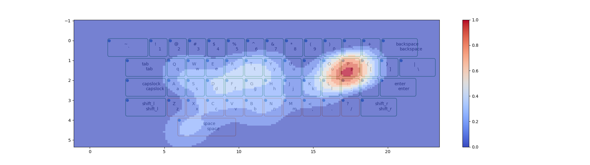

# Introduction

This document describes the implementation of a typing heatmap program
using Python and Matplotlib. The program reads keyboard input, processes
it in real-time, and displays a heatmap over a visualized keyboard. The
heatmap intensity grows with the frequency of keystrokes. This is useful
for analyzing typing patterns or for applications like keyboard layout
optimization.

<figure>

<figcaption>Heatmap</figcaption>
</figure>

# Usage

To use this program, you need two things:

- A working machine which can display graphical windows. The real time
  updation won’t work on a Jupyter Server

- An `.xml` file which describes the keyboard layout in a certain
  format. The documentation for the format is provided at the end.

At the end, the final heatmap will be saved with the name `heatmap.png`

# Overview of Components

The program consists of the following major components:

- **xmlParser**: Parses the keyboard layout from an XML file and
  generates a keymap.

- **Painter**: Handles the graphical display of the keyboard and updates
  the heatmap based on key presses.

- **AsyncIO**: Captures user input from the terminal and integrates it
  into the heatmap update loop.

- **main()**: The main function that initializes the above components
  and controls the event loop for reading input.

# Class Descriptions

## Class `xmlParser`

The `xmlParser` class is responsible for parsing the keyboard layout
from an XML file. The key functionalities include:

- `__init__`: Initializes the parser by loading the XML file and setting
  up shift mappings.

- `get_keys`, `get_rows`, `get_positions`, `get_x`, `get_y`: Helper
  functions to retrieve specific elements (keys, rows, positions, etc.)
  from the XML tree.

- `print_keymap`: Prints the parsed keymap with their positions.

- `__default_shift`: Provides default shift mappings for common keys.

- `__generate_keylist`: Ensures that key definitions are valid and
  assigns shift mappings where applicable.

## Class `Painter`

The `Painter` class manages the visualization of the keyboard and the
heatmap. Its main tasks are:

- `__init__`: Initializes the keyboard visualization and sets up the
  plot with Matplotlib.

- `update_heatmap`: Updates the heatmap based on the keys pressed.

- `__update_points`: Generates a Gaussian distribution to create a
  smooth heatmap effect around key presses.

- `__draw_keys`: Draws the keyboard layout with the appropriate
  positions of keys.

- `close`: Saves the heatmap as an image when the program is closed.

## Class `AsyncIO`

This class handles capturing keyboard input in real-time from the
terminal. It provides:

- `set`: Configures the terminal for raw input mode.

- `getch`: Reads a character from stdin in raw mode.

- `reset`: Resets the terminal settings to their original state.

# Main Function

The `main()` function is the entry point of the program. It initializes
the `xmlParser`, `Painter`, and `AsyncIO` classes, then enters a loop
where it continuously listens for key presses and updates the heatmap.

## Initialization

First, the keyboard layout is parsed using `xmlParser`, and the
`Painter` object is created to handle graphical rendering. The `AsyncIO`
object is initialized to capture key presses in real-time.

## Event Loop

The program enters an infinite loop where it reads key presses using
`getch_unix()` from the `AsyncIO` class. Each key press is displayed in
the terminal and fed into the heatmap update function.

# Documentation for custom xml format

I am using a custom xml format for easy parsing and defining of the
layout, this allows me to specify a great deal of detail in a widely
supported format which can be read by other programming languages as
well. Given the time constraints I have not implemented these ideas, but
I list them here:

- specify UI elements like size and color of the keys and heatmap.

- specify the hand position

- use faster languages to optimize the layout and generate the xml to
  test using python

# Root Element: `<kbd>`

The root element `<kbd>` represents the entire keyboard layout.

- **Attributes:**

  - `name`: The name of the keyboard (e.g., “qwerty keyboard”).

# Row Element: `<row>`

The `<row>` element represents a single row of keys on the keyboard.
NOTE: your layout must have a Row element with the attribute `’home’`.
This row will be used for distance calculations.

- **Attributes:**

  - `id`: An identifier for the row (e.g., `’row1’`, `’row2’`).

- **Child Elements:**

  - Contains multiple `<key>` elements, each representing a key within
    the row.

# Key Element: `<key>`

The `<key>` element represents an individual key on the keyboard.

- **Attributes:**

  - `lower`: The character produced when the key is pressed without any
    modifier (e.g., lowercase letters, numbers).

  - `upper`: The character produced when the key is pressed with the
    Shift modifier (e.g., uppercase letters, special characters). This
    attribute may be omitted for keys without an upper case, such as
    `Backspace` or `Enter`.

- **Child Element:**

  - `<pos>`: Specifies the position of the key on the keyboard.

    - `<x>`: The horizontal position of the key within the row.

    - `<y>`: The vertical position of the key (indicating the row
      number).

# Special Keys

Some keys such as `Backspace`, `Enter`, `Space`, and modifier keys like
`Shift` and `CapsLock` are represented without an `upper` attribute.
These keys have specific functionality and do not produce character
output.

# Example Breakdown

## Row 1 (Numbers and Special Characters)

The first row contains the number keys and their corresponding special
characters. Each key has both `lower` and `upper` values.

``` xml
<row id='row1'>
    <key lower="1" upper="!">
        <pos><x>1</x><y>0</y></pos>
    </key>
</row>
```

## Row 2 (QWERTY Letters)

The second row contains the QWERTY letter keys. Each key specifies both
its lowercase and uppercase variants.

``` xml
<row id='row2'>
    <key lower="q" upper="Q">
        <pos><x>0.5</x><y>1</y></pos>
    </key>
</row>
```

## Special Keys

Special keys, such as `Backspace`, are defined with a `lower` attribute
only.

``` xml
<key lower="Backspace">
    <pos><x>13</x><y>0</y></pos>
</key>
```

## Space Bar

The space bar is defined as a large key that spans the center of the
keyboard layout.

``` xml
<row id='space'>
    <key lower="Space">
        <pos><x>3.5</x><y>4</y></pos>
    </key>
</row>
```

This XML structure allows easy customization of keyboard layouts by
specifying key values and positions.
